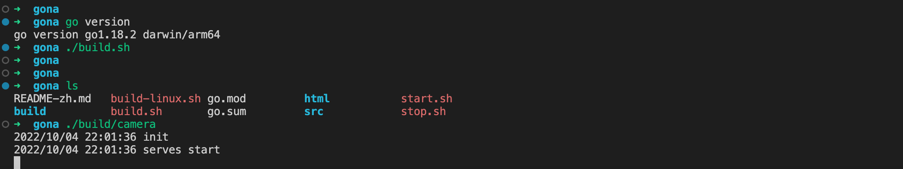
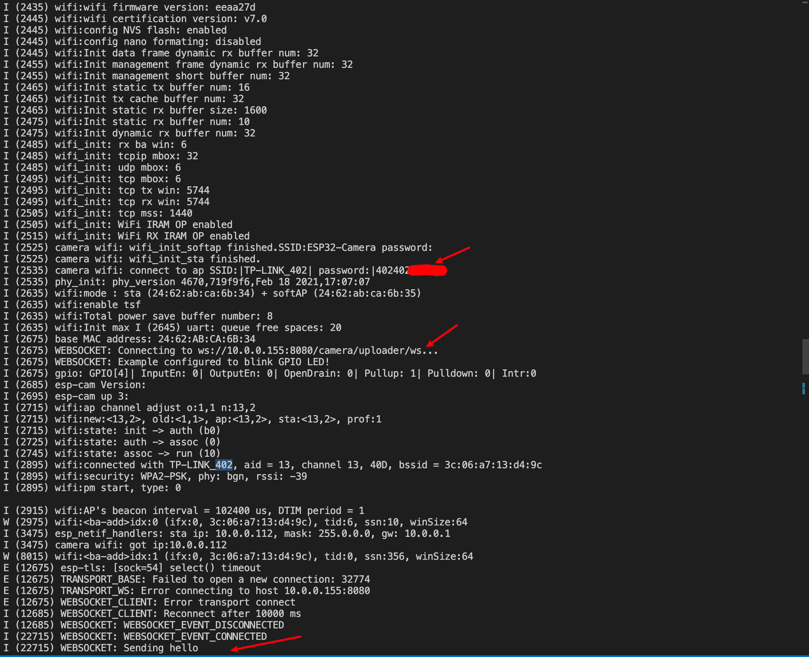
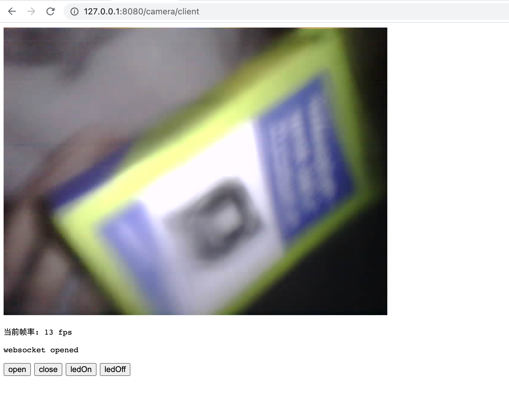

<!--
 * @Author: Vitcou
 * @Date: 2022-07-21 01:47:54
 * @Description: 
-->
### 介绍
Andas 设备项目工程

### 文档

详细文档如下

[Java服务 Juli](./server/juli/README-zh.md)

[Go服务 Gona](./server/gona/README-zh.md)

[ESP32-CAM](./device/esp32-cam/README-zh.md)

### 环境
server: 
+ juli: Java server
+ gona: Go server

device:
+ esp-cam
  
### 构建

查看子目录

### 运行
#### ESP-CAM websocket推流
1.运行服务

2.设备连接

3.应用端查看
查看地址如下，因为服务的索引不一样，还在修改中 
gona: http://127.0.0.1:8080/camera/client
juli: http://127.0.0.1:8080/camera/client.html

