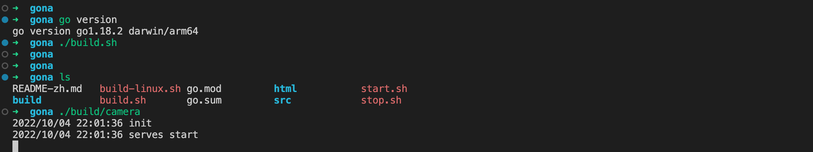
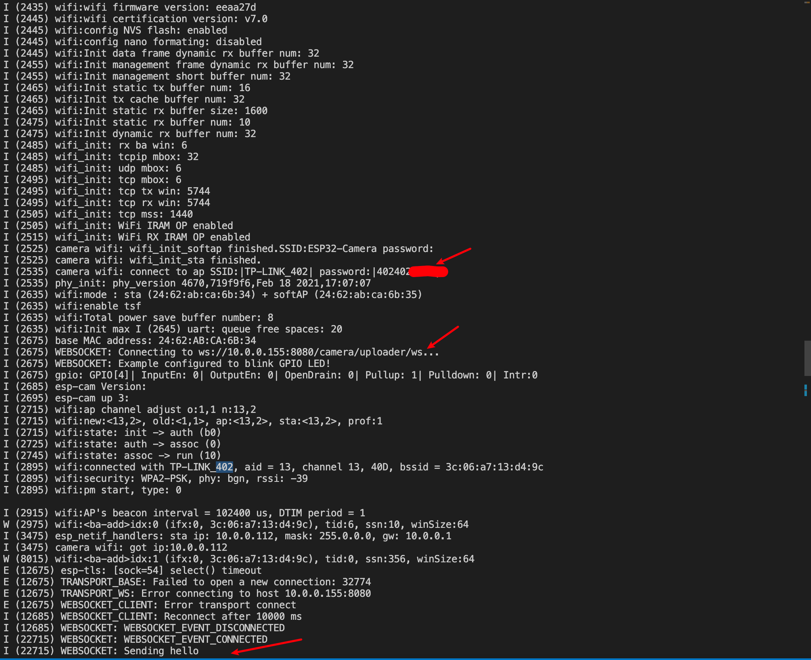
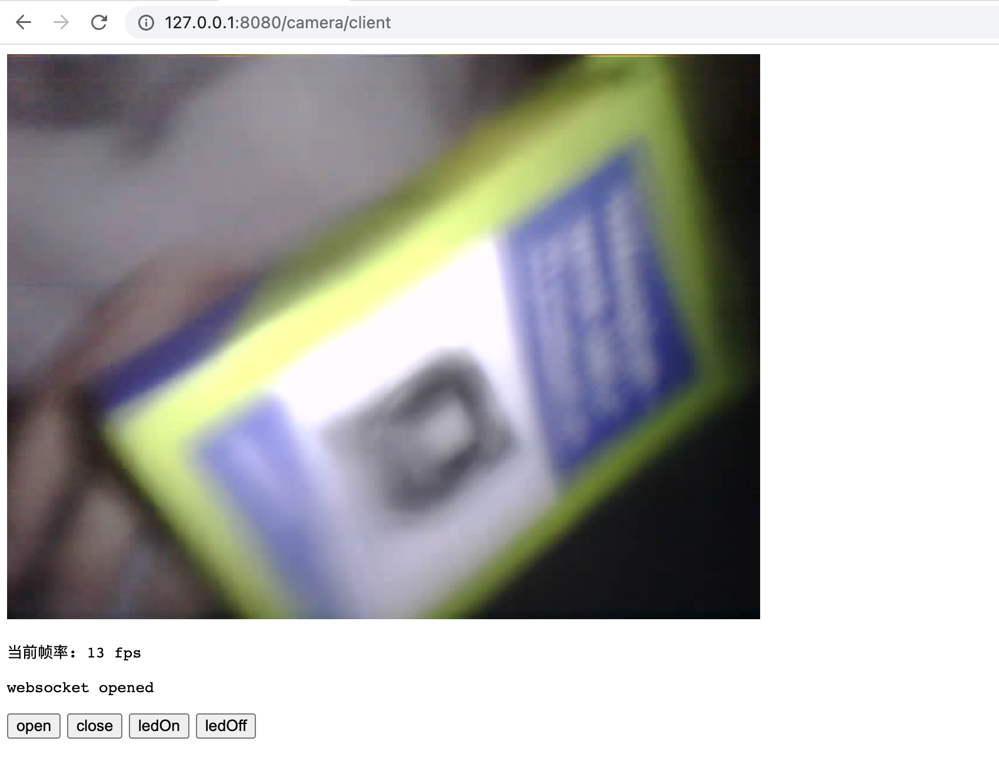

<!--
 * @Author: Vitcou
 * @Date: 2022-07-21 01:47:54
 * @Description: 
-->
Andas Project
---

[Andas 中文文档](./README-zh.md)

### About

Andas, A Project about device intelligent service.

### Document

More document please check below.

[Java service Juli](./server/juli/README-zh.md)

[Go service Gona](./server/gona/README-zh.md)

[ESP32-CAM](./device/esp32-cam/README-zh.md)

### Environment
server: 
+ juli: Java server
+ gona: Go server

device:
+ esp32-cam
  
  
### Build

Please check subdirectory.

### Run
#### ESP32-CAM websocket camera stream.
1.Star service

2.Device connect

3.Web application page
Web page url below.
gona: http://127.0.0.1:8080/camera/client
juli: http://127.0.0.1:8080/camera/client.html

