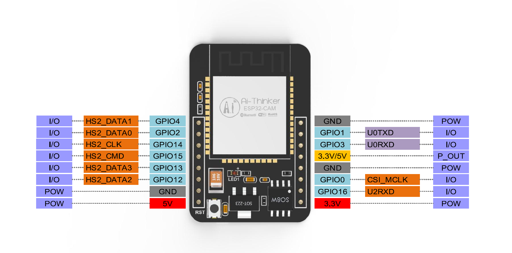

<!--
 * @Author: Vitcou
 * @Date: 2022-09-14 00:34:14
 * @Description: 
-->
### 介绍
Andas 项目设备 ESP32-CAM

### 设备需要
ESP32-CAM


### 环境依赖
ESP-IDF: v4.4.2-dirty

### 配置

这里使用，idf.py进行参数配置
```shell
idf.py menuconfig
```
配置入口


WiFi配置


websocket 服务配置


### 编译
```shell
idf.py build
```


### 下载

我的是MacOS系统，使用的串口设备如下
```shell
idf.py -p /dev/cu.usbserial-0001 -b 115200 flash
```

### 运行

#### 关键日志
日志：Wifi配置
```shell
I (2535) camera wifi: connect to ap SSID:|TP-LINK_402| password:|402402xxxxx|
```

日志：服务websocket地址，填写开启了服务的ip地址，如果是本电脑开启可以

win电脑在cmd查看IP
```shell
ipconfig
```
unix/linux/macos
```shell
ifconfig
```

```shell
I (2675) WEBSOCKET: Connecting to ws://10.0.0.155:8080/camera/uploader/ws...
```

日志：连接服务成功
```shell
I (22715) WEBSOCKET: WEBSOCKET_EVENT_CONNECTED
```


### 工程清理
```shell
idf.py fullclean
```